.. _themes:

Themes
######

All of the following themes are available with ttkbootstrap and can be viewed live with the ttkbootstrap demo:

.. code-block:: python

    python -m ttkbootstrap

Light themes
............
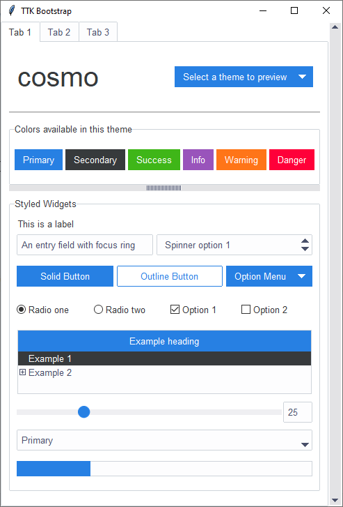

    inspired by https://bootswatch.com/cosmo/

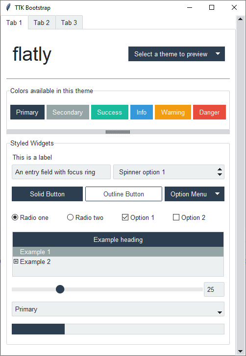

    inspired by https://bootswatch.com/flatly/

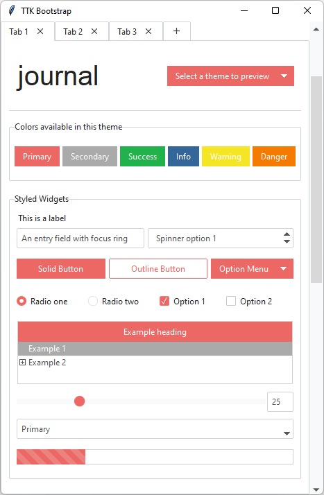

    inspired by https://bootswatch.com/journal/

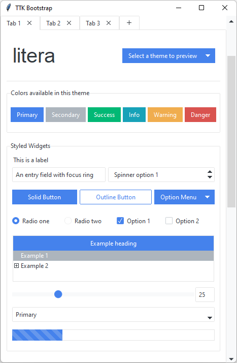

    inspired by https://bootswatch.com/litera/

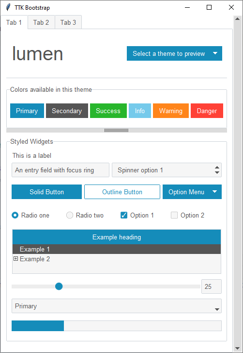

    inspired by https://bootswatch.com/lumen/

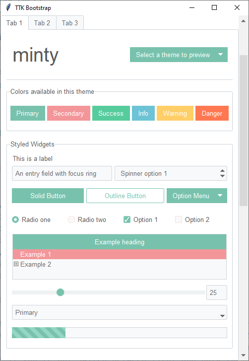

    inspired by https://bootswatch.com/minty/

.. figure:: images/pulse.png
    :alt: an example image of theme pulse

    inspired by https://bootswatch.com/pulse/

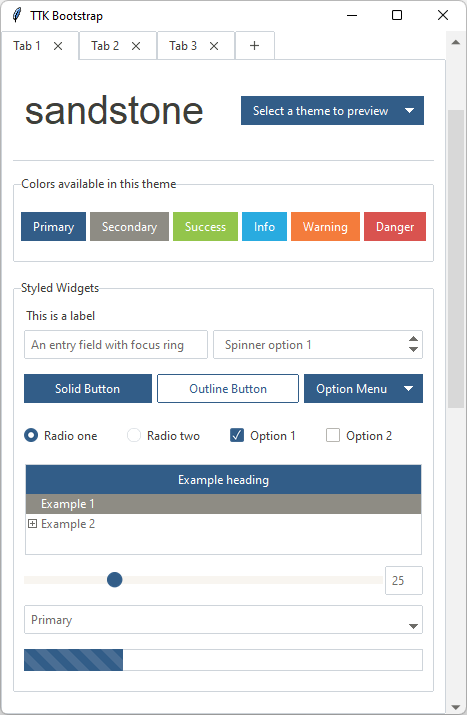

    inspired by https://bootswatch.com/sandstone/

.. figure:: images/united.png
    :alt: an example image of theme united

    inspired by https://bootswatch.com/united/

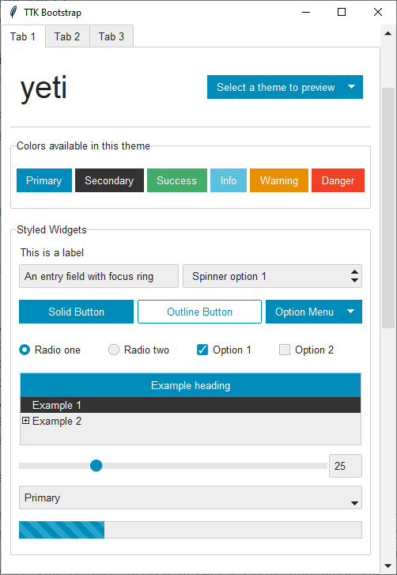

    inspired by https://bootswatch.com/yeti/

Dark themes
...........
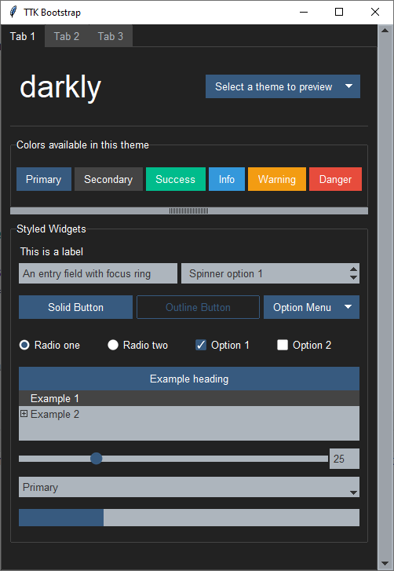

    inspired by https://bootswatch.com/darkly/

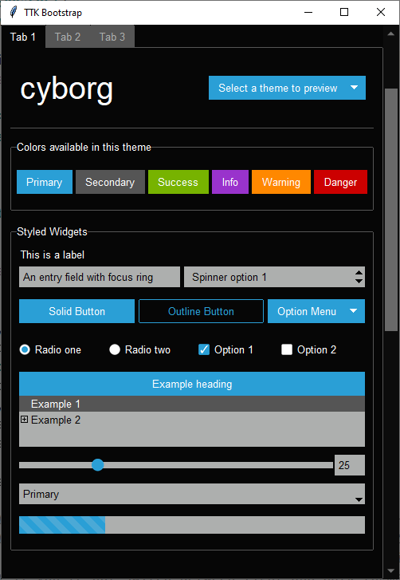

    inspired by https://bootswatch.com/cyborg/

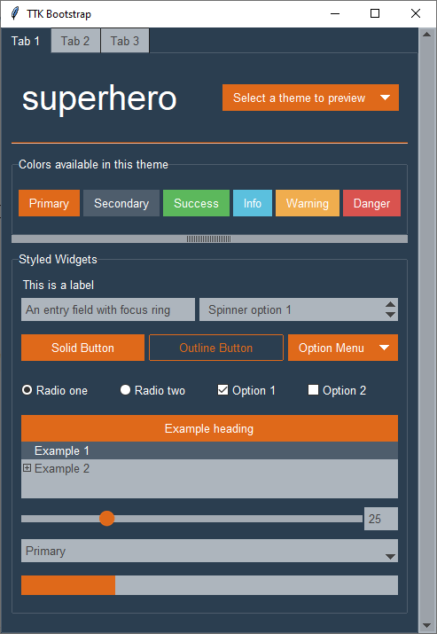

    inspired by https://bootswatch.com/superhero/

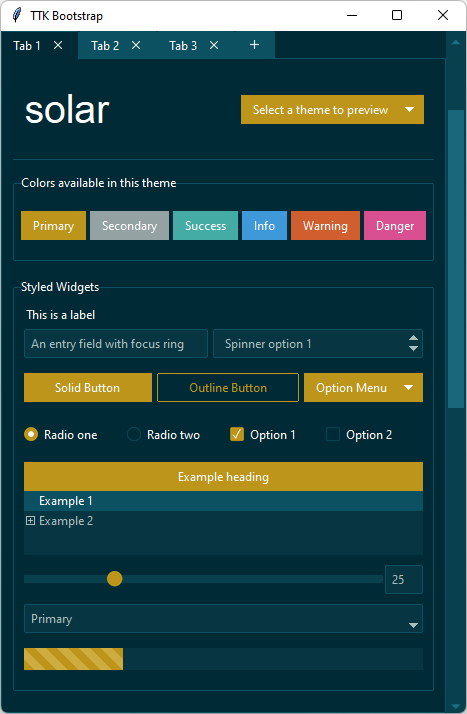

    inspired by https://bootswatch.com/solar/

How are themes created?
.......................
Imagine being able to take the parts from several existing cars to design the one that you really want... that's
basically how ttkbootstrap was created... I used the best parts of the existing themes to craft a brand new theme
template.

The base of all widgets in the ttkbootstrap template is the *clam* theme. You may be wondering why the ttkbootstrap
theme looks so different than the built-in clam theme... Each ttk widget is created from a collection of elements.
These elements, when combined together, create what we see as a ttk widget. Aside from changing colors and state
behavior, I constructed new widget layouts using the elements from various themes to give the desired look and feel.
There is an old, but excellent reference to widget layouts here_.

.. _here: https://anzeljg.github.io/rin2/book2/2405/docs/tkinter/ttk-themes.html

As an example: the ``ttk.Combobox`` widget contains a *field* element. In order to get the border effect I wanted,
I constructed a new layout for the ``ttk.Combobox`` using the *field* from the ``ttk.Spinbox``.

So, the ``ttkbootstrap.StylerTTK`` contains the style template for all ttkbootstrap themes. From there, a set of
theme definitions (which includes color maps, default font, etc...) are extracted from a json file at runtime and
loaded as a new theme by the ``ttkbootstrap.Style`` class.

.. code-block:: python

    {
      "name": "lumen",
      "font": "Helvetica",
      "type": "light",
      "colors": {
        "primary": "#158cba",
        "secondary": "#555555",
        "success": "#28b62c",
        "info": "#75caeb",
        "warning": "#ff851b",
        "danger": "#ff4136",
        "bg": "#ffffff",
        "fg": "#555555",
        "selectbg": "#555555",
        "selectfg": "#ffffff",
        "light": "#f6f6f6",
        "border": "#ced4da",
        "inputfg": "#888888"
      }
    }

This theme definition is read by the ``ttkbootstrap.Style`` class and converted into an actual theme by the
``ttkbootstrap.StylerTTK`` class at runtime. At that point, it is available to use like any other theme. The only
information about a theme that is stored (built-in or user-defined) is the theme definition.

Legacy widget styles
....................
While they are not the focus of this package, if you need to use legacy tkinter widgets, they should not look completely
out-of-place. Below is an example of the widgets using the **journal** style. Legacy tkinter widgets will have the
primary color applied. If you wish to use other theme colors on the widgets, you can override the styles as you would
normally when using tkinter widgets. The theme colors are available in the ``Style.colors`` property.

.. figure:: images/legacy.png
    :alt: an example image of legacy tkinter widgets styled with journal