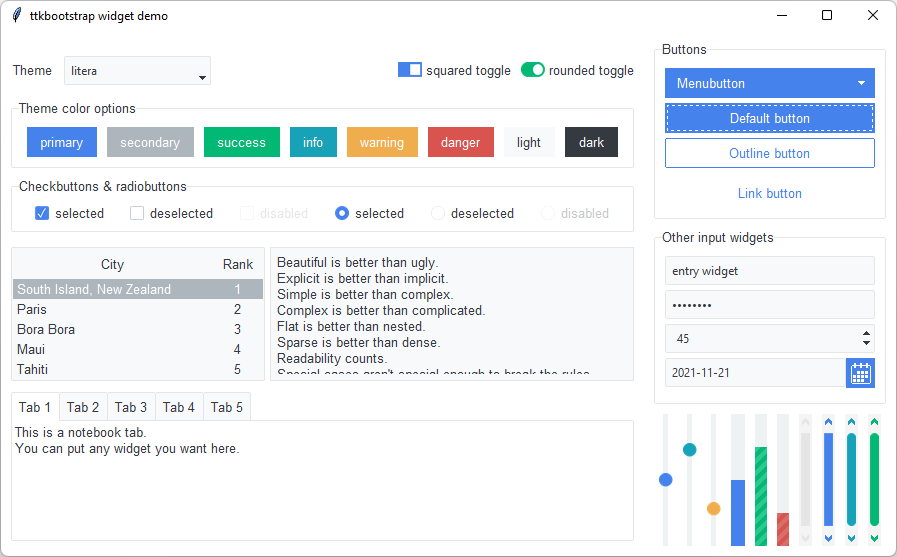

# 主题

ttkbootstrap 附带了许多风格精美的浅色和深色主题，您可以在 _安装 ttkbootstrap 后_ 在终端中键入此命令，在演示中查看这些主题。

```shell
>>> python -m ttkbootstrap
```

您将看到如下图所示的演示屏幕。 在 **Select a theme** 下拉框中更改主题选择，演示屏幕将更新为新主题。

您还可以查看 [浅色主题](light.md) 和 [深色主题](dark.md) 的屏幕截图。

