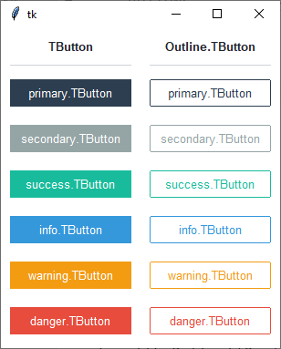

Button
------
A ``ttk.Button`` widget displays a textual label and/or image, and evaluates a command when pressed.

.. code-block:: python

    button = ttk.Button(parent, option=value, ...)

Options
=======
:class\_:
    The widget class name. This may be specified when the widget is created, but cannot be changed later.

:command:
    A function to be called when the button is pressed.

:compound:
    If you provide both ``image`` and ``text`` options, the ``compound`` option specifies the position of the image
    relative to the text. The value may be `top`, `bottom`, `left`, or `right`.

    When you provide both ``image`` and ``text`` options but don't specify a ``compound`` option, the image will appear
    and the text will not.

:cursor:
    The cursor that will appear when the mouse is over the button.

:image:
    An image to appear on the button.

:style:
    The style to be used in rendering this button.

:takefocus:
    By default, the ``ttk.Button`` will be included in focus traversal. To remove the widget from focus traversal, use
    ``takefocus=False``.

:text:
    The text to appear on the button, as a string.

:textvariable:
    A variable that controls the text that appears in the button.

:underline:
    If this option has a non-negative value `n`, an underline will appear under the character at position `n`.

:width:
    If the label is text, this option specifies the absolute width of the text area on the button, as a number of
    characters; the actual width is that number multiplied by the average width of a character in the current font.
    For image labels, this option is ignored. The option may be configured in style.

Commands
========
In addition to the standard **cget, configure, identify, instate,** and **state** commands, buttons support the
following additional widget commands:

:invoke():

    Invokes the command associated with the button

Styles
======
The ``ttk.Button`` includes the **TButton** and **Outline.TButton** style classes. The **TButton** class is applied to
all buttons by default. Other styles must be specified in the button's ``style`` option. These two primary style
classes are further subclassed by each of the theme colors to produce the following color and style combinations:

Use the *color.Class* pattern in the button's ``style`` option to use a pre-defined style class.

:style patterns:

    - color.TButton
    - color.Outline.Button

:colors:

    - primary (default)
    - secondary
    - success
    - info
    - warning
    - danger

.. code-block:: python

    # default solid button
    ttk.Button(parent, text='Submit')

    # default outline button
    ttk.Button(parent, text='Submit', style='Outline.TButton')

    # "info" solid button
    ttk.Button(parent, text='Submit', style='info.TButton')

    # "warning" outline button
    ttk.Button(parent, text="Submit", style='warning.Outline.TButton')

Tips & tricks
=============
Apply the **TLabel** style class to remove the button's hover effects and to invert the colors. The button will still
behave as a button, though it will look like a standard label.  Conversely, you can apply a **TButton** class to a label
to inherit the colors and hover effects of the button.

Configuration
=============
Use the following classes, states, and options when configuring or modifying a new ttk button style.

:class names:
    - TButton
    - Outline.TButton

:dynamic states:
    - active
    - disabled
    - pressed
    - readonly

:configurable style options:
    - anchor `anchor`
    - background `color`
    - bordercolor `color`
    - compound `compound`
    - darkcolor `color`
    - foreground `foreground`
    - font `font`
    - highlightcolor `color`
    - highlightthickness `amount`
    - lightcolor `color`
    - padding `padding`
    - relief `relief`
    - shiftrelief `amount`
    - width `amount`

.. code-block:: python

    # change the font and font-size on all buttons
    Style.configure('TButton', font=('Helvetica', 12))

    # change the foreground color when the button is active
    Style.map('TButton', foreground=[
        ('disabled', 'white'),
        ('active', 'yellow')])

    # subclass an existing style to create a new one, using the pattern 'newstyle.OldStyle'
    Style.configure('custom.TButton', background='red', foreground='white', font=('Helvetica', 24))

    # use a custom style
    ttk.Button(parent, text='Submit', style='custom.TButton')

*Some style options are only available to specific styles*

References
==========
- https://www.pythontutorial.net/tkinter/tkinter-button/
- https://anzeljg.github.io/rin2/book2/2405/docs/tkinter/ttk-Button.html
- https://www.tcl.tk/man/tcl8.6/TkCmd/ttk_button.htm
