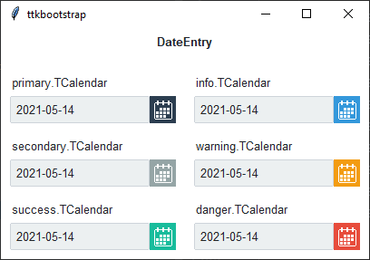
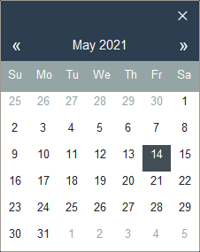
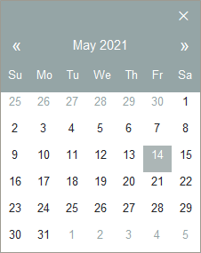
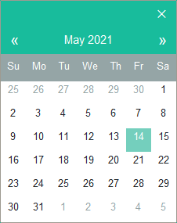
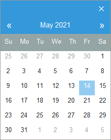
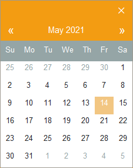
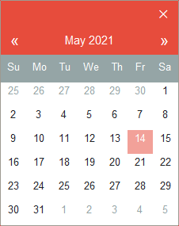

Calendar
########
The calendar module contains several classes and functions that enable the user to select a date.

.. note::

    This is a **style guide** for using ttkbootstrap styles. This guide will show you how to **apply visual styles** to
    change the look and feel of the widget. For more information on how to use the widget and what options are
    available, consult the :ref:`reference section on widgets <reference:dateentry>`.

Overview
========
The ``DateEntry`` and ``DateChooserPopup`` are the two classes that you will use along with the ``calendar.ask_date()``
helper function.

The ``DateEntry`` widget is a ``ttk.Entry`` widget combined with a ``ttk.Button`` widget that opens up a
``DateChooserPopup`` when pressed. It is recommended to `not use` the ``DateChooserPopup`` directly, unless you want to
subclass it, but rather to use it via the ``calendar.ask_date()`` method, which opens up a ``DateChooserPopup`` and
returns the selected value as a ``datetime`` object.

All of these objects have a ``style`` parameter that accept a **TCalendar** style. By default, the `primary` color is
applied to the widget. However, the base style is further subclassed by each of the theme colors to produce the
following color and style combinations for ``DateEntry`` and ``DateChooserPopup``.

The styles above correspond to the same colored ``DateChooserPopup`` below:

How to use
==========
The examples below demonstrate how to *use a style* when creating a calendar widget.

Create a default **date entry**

.. code-block:: python

    DateEntry(parent)

Create a **success date entry**

.. code-block:: python

    DateEntry(parent, style='success.TCalendar')

Create a button that calls the calendar popup by assigning a callback.

.. code-block:: python

    def callback():
        return ask_date()

    btn = ttk.Button(parent, text='Get Date', command=callback)

Style configuration
===================
Use the following classes, states, and options when configuring or modifying a new calendar style. Some options are only
available in certain styles. See the `python style documentation`_ for more information on creating a style.

:ref:`tutorial:create a new theme` using TTK Creator if you want to change the default color scheme.

Class names
-----------
- TCalendar

Dynamic states
--------------
- active
- alternate
- disabled
- pressed
- selected
- readonly

Style options
-------------
:background: `color`
:compound: `compound`
:foreground: `foreground`
:focuscolor: `color`
:focusthickness: `amount`
:font: `font`
:padding: `padding`

Create a custom style
=====================

Change the **font** and **font-size** on all calendar buttons

.. code-block:: python

    Style.configure('TCalendar', font=('helvetica', 12))

Change the **foreground color** when the calendar date is **selected**

.. code-block:: python

    Style.map('TCalendar', foreground=[
        ('disabled', 'white'),
        ('selected', 'yellow'),
        ('!selected', 'gray')])

Subclass an existing style to create a new one, using the pattern 'newstyle.OldStyle'

.. code-block:: python

    Style.configure('custom.TCalendar', foreground='tan', font=('Helvetica', 10))

Use a custom style

.. code-block:: python

    DateEntry(parent, style='custom.TCalendar')

