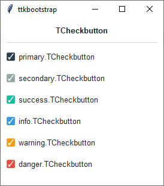
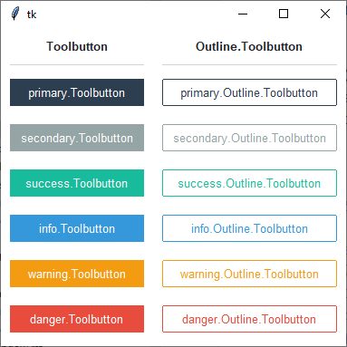
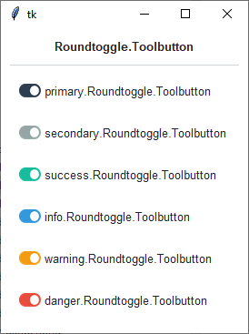

Checkbutton
###########
A ``ttk.Checkbutton`` widget is used to show or change a setting. It has two states, selected and deselected. The state
of the checkbutton may be linked to a tkinter variable.

Overview
========
The ``ttk.Checkbutton`` includes the **TCheckbutton**, **Toolbutton**, **Outline.Toolbutton**,
**Roundtoggle.Toolbutton**, and **Squaretoggle.Toolbutton** style classes. The **TCheckbutton** style is applied to all
checkbuttons by default. Other styles must be specified with the ``style`` option. These primary styles are
further subclassed by each of the theme colors to produce the following color and style combinations:

Classic checkbutton
-------------------

Classic toolbutton
------------------

Round toggle button
-------------------

Square toggle button
--------------------

.. image:: images/squaretoggle.png

How to use
==========

Create a default **checkbutton**

.. code-block:: python

    ttk.Checkbutton(parent, text='include', value=1)

Create a default **toolbutton**

.. code-block:: python

    ttk.Checkbutton(parent, text='include', style='Toolbutton')

Create a default **outline toolbutton**

.. code-block:: python

    ttk.Checkbutton(parent, text='include', style='Outline.Toolbutton')

Create a default **round toggle** toolbutton

.. code-block:: python

    ttk.Checkbutton(parent, text='include', style='Roundtoggle.Toolbutton')

Create a default **square toggle** toolbutton

.. code-block:: python

    ttk.Checkbutton(parent, text='include', style='Squaretoggle.Toolbutton')

Create an **'info' checkbutton**

.. code-block:: python

    ttk.Checkbutton(parent, text='include', style='info.TCheckbutton')

Create a **'warning' outline toolbutton**

.. code-block:: python

    ttk.Checkbutton(parent, text="include", style='warning.Outline.Toolbutton')

Style configuration
===================
Use the following classes, states, and options when configuring or modifying a new ttk checkbutton style. TTK Bootstrap
uses an image layout for this widget, so not all of these options will be available... for example: ``indicatormargin``.
However, if you decide to create a new widget, these should be available, depending on the style you are using as a
base. Some options are only available in certain styles.

Class names
-----------
- TCheckbutton
- Toolbutton
- Outline.Toolbutton
- Roundtoggle.Toolbutton
- Squaretoggle.Toolbutton

Dynamic states
--------------
- active
- alternate
- disabled
- pressed
- selected
- readonly

Style options
-------------
:background: `color`
:compound: `compound`
:foreground: `foreground`
:focuscolor: `color`
:focusthickness: `amount`
:font: `font`
:padding: `padding`

Create a custom style
=====================

Change the **font** and **font-size** on all buttons

.. code-block:: python

    Style.configure('TCheckbutton', font=('Helvetica', 12))

Change the **foreground color** when the checkbutton is **selected**

.. code-block:: python

    Style.map('TCheckbutton', foreground=[
        ('disabled', 'white'),
        ('selected', 'yellow'),
        ('!selected', 'gray')])

Subclass an existing style to create a new one, using the pattern 'newstyle.OldStyle'

.. code-block:: python

    Style.configure('custom.TCheckbutton', foreground='white', font=('Helvetica', 24))

Use a custom style

.. code-block:: python

    ttk.Checkbutton(parent, text='include', style='custom.TCheckbutton')

References
==========
- https://www.pythontutorial.net/tkinter/tkinter-checkbox/
- https://anzeljg.github.io/rin2/book2/2405/docs/tkinter/ttk-Checkbutton.html
- https://www.tcl.tk/man/tcl8.6/TkCmd/ttk_checkbutton.htm
