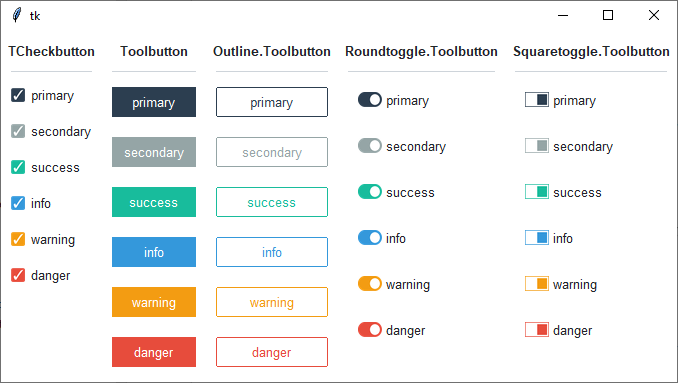

Checkbutton
-----------
A ``ttk.Checkbutton`` an on/off widget.

.. code-block:: python

    button = ttk.Checkbutton(parent, option=value, ...)

Options
=======
:class\_:
    The widget class name. This may be specified when the widget is created, but cannot be changed later.

:command:
    A function to be called whenever the state of the checkbutton changes.

:compound:
    If you provide both ``image`` and ``text`` options, the ``compound`` option specifies the position of the image
    relative to the text. The value may be `top`, `bottom`, `left`, or `right`.

    When you provide both ``image`` and ``text`` options but don't specify a ``compound`` option, the image will appear
    and the text will not.

:cursor:
    The cursor that will appear when the mouse is over the checkbutton.

:image:
    An image to appear on the checkbutton.

:offvalue:
    By default, when a checkbutton is in the off (unchecked) state, the value of the associated ``variable`` is 0. You
    can use the ``offvalue`` option to specify a different value for the off state.

:onevalue:
    By default, when a checkbutton is in the on (checked) state, the value of the associated ``variable`` is 1. You can
    use the ``onvalue`` option to specify a different value for the off state.

:style:
    The style to be used in rendering this checkbutton.

:takefocus:
    By default, the ``ttk.CheckButton`` will be included in focus traversal. To remove the widget from focus traversal,
    use ``takefocus=False``.

:text:
    The text to appear on the checkbutton, as a string.

:textvariable:
    A variable that controls the text that appears on the checkbutton.

:underline:
    If this option has a non-negative value `n`, an underline will appear under the character at position `n`.

:variable:
    A control variable that tracks the current state of the checkbutton. Normally you will use the ``IntVar`` here, and
    the off and on values are 0 and 1, respectively. However, you may use a different control variable type, and
    specify the ``offvalue`` and ``onvalue`` options using values of that type.

:width:
    Use this option to specify a fixed width or minimum width. The value is specified in characters; a positive value
    sets a fixed width of that many average characters, while a negative width sets a minimum width.

Commands
========
In addition to the standard **cget, configure, identify, instate,** and **state** commands, buttons support the
following additional widget commands:

:invoke():

    This method toggles the state of the checkbutton. If there is a ``command`` callback, it calls that callback, and
    returns whatever value the callback returned.

Styles
======
The ``ttk.Checkbutton`` includes the **TCheckbutton**, **Toolbutton**, **Outline.Toolbutton**, **Roundtoggle.Toolbutton**,
and **Squaretoggle.Toolbutton** style classes. The **TCheckbutton** class is applied to all checkbuttons by default.
Other styles must be specified in the checkbutton's ``style`` option. These primary classes are further subclassed by
each of the theme colors to produce the following color and style combinations:

Use the *color.Class* pattern in the button's ``style`` option to use a pre-defined style class.

:style patterns:

    - color.TCheckbutton
    - color.Toolbutton
    - color.Outline.Toolbutton
    - color.Roundtoggle.Toolbutton
    - color.Squaretoggle.Toolbutton

:colors:

    - primary (default)
    - secondary
    - success
    - info
    - warning
    - danger

.. code-block:: python

    # default checkbutton
    ttk.Checkbutton(parent, text='include', value=1)

    # default toolbutton
    ttk.Checkbutton(parent, text='include', style='Toolbutton')

    # default outline toolbutton
    ttk.Checkbutton(parent, text='include', style='Outline.Toolbutton')

    # default round toggle toolbutton
    ttk.Checkbutton(parent, text='include', style='Roundtoggle.Toolbutton')

    # default square toggle toolbutton
    ttk.Checkbutton(parent, text='include', style='Squaretoggle.Toolbutton')

    # "info" checkbutton
    ttk.Checkbutton(parent, text='include', style='info.TCheckbutton')

    # "warning" outline toolbutton
    ttk.Checkbutton(parent, text="include", style='warning.Outline.Toolbutton')

Configuration
=============
Use the following classes, states, and options when configuring or modifying a new ttk checkbutton style. TTK Bootstrap
uses an image layout for this widget, so not all of these options will be available... for example: ``indicatormargin``.
However, if you decide to create a new widget, these should be available, depending on the style you are using as a
base. Some options are only available in certain styles.

:class names:
    - TCheckbutton
    - Toolbutton
    - Outline.Toolbutton
    - Roundtoggle.Toolbutton
    - Squaretoggle.Toolbutton

:dynamic states:
    - selected
    - deselected

:configurable style options:
    - background `color`
    - compound `compound`
    - foreground `foreground`
    - indicatorbackground `color`
    - indicatormargin `padding`
    - indicatorrelief `relief`
    - padding `padding`

.. code-block:: python

    # change the font and font-size on all buttons
    Style.configure('TCheckbutton', font=('Helvetica', 12))

    # change the foreground color when the checkbutton is selected
    Style.map('TCheckbutton', foreground=[
        ('disabled', 'white'),
        ('selected', 'yellow'),
        ('!selected', 'gray')])

    # subclass an existing style to create a new one, using the pattern 'newstyle.OldStyle'
    Style.configure('custom.TCheckbutton', foreground='white', font=('Helvetica', 24))

    # use a custom style
    ttk.Checkbutton(parent, text='include', style='custom.TCheckbutton')

References
==========
- https://www.pythontutorial.net/tkinter/tkinter-checkbox/
- https://anzeljg.github.io/rin2/book2/2405/docs/tkinter/ttk-Checkbutton.html
- https://www.tcl.tk/man/tcl8.6/TkCmd/ttk_checkbutton.htm
