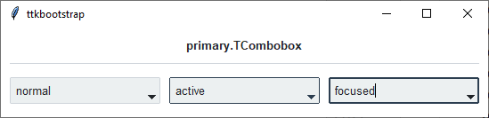
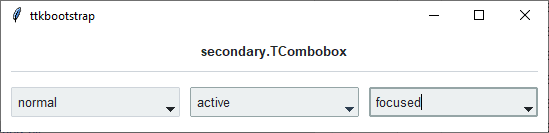
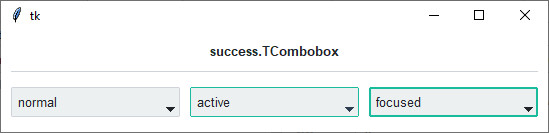
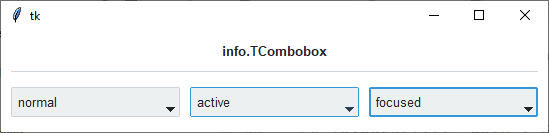
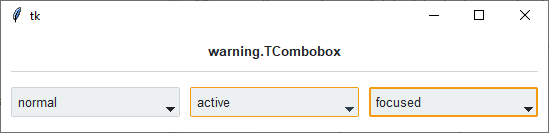
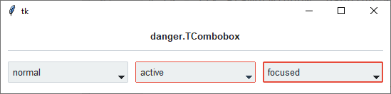

Combobox
########
A ``ttk.Combobox`` widget is a combination of an Entry and a drop-down menu. In your application, you will see the usual
text entry area, with a downward-pointing arrow. When the user clicks on the arrow, a drop-down menu appears. If the
user clicks on one, that choice replaces the current contents of the entry. However, the user may still type text
directly into the entry (when it has focus), or edit the current text.

Styles
======

The ``ttk.Combobox`` includes the **TCombobox** class. This style is further subclassed by each of the theme colors to
produce the following color and style combinations.

As you can see, in a *normal* state, all styles look the same. What distinguishes them are the colors that are used
for the *highlight* in an **active** (hover) state, and **focused** state.

How to use
==========

Create a default **combobox**

.. code-block:: python

    cb = ttk.Combobox(parent)

    for option in ['option 1', 'option 2', 'option 3']:
        cb.insert('end', option)

Create an **'info' combobox**

.. code-block:: python

    ttk.Combobox(parent, style='info.TCombobox')

Configuration
=============

Use the following classes, states, and options when configuring or modifying a new ttk combobox style.

Class names
-----------
- TCombobox

Dynamic states
--------------
- disabled
- focus
- pressed
- readonly

Style options
-------------

:anchor: `e, w, center`
:arrowcolor: `color`
:arrowsize: `amount`
:background: `color`
:bordercolor: `color`
:borderwidth: `amount`
:darkcolor: `color`
:fieldbackground: `color`
:foreground: `color`
:font: `font`
:lightcolor: `color`
:padding: `padding`
:relief: `flat, groove, raised, ridge, solid, sunken`
:width: `amount`

.. note:: The popdown list cannot be configured using the ``Style`` class. Instead, you must use the tk option database.

    - ``tk.option_add('*TCombobox*Listbox.background', color)``
    - ``tk.option_add('*TCombobox*Listbox.font', font)``
    - ``tk.option_add('*TCombobox*Listbox.foreground', color)``
    - ``tk.option_add('*TCombobox*Listbox.selectBackground', color)``
    - ``tk.option_add('*TCombobox*Listbox.selectForeground', color)``

Create a custom style
---------------------

Change the **font** and **font-size** on all comboboxes

.. code-block:: python

    Style.configure('TCombobox', font=('Helvetica', 12))

Change the **arrow color** when in different states

.. code-block:: python

    Style.map('TCombobox', arrowcolor=[
        ('disabled', 'gray'),
        ('pressed !disabled', 'blue'),
        ('focus !disabled', 'green'),
        ('hover !disabled', 'yellow')])

Subclass an existing style to create a new one, using the pattern 'newstyle.OldStyle'

.. code-block:: python

    Style.configure('custom.TCombobox', background='green', foreground='white', font=('Helvetica', 24))

Use a custom style

.. code-block:: python

    ttk.Combobox(parent, style='custom.TCombobox')

References
==========
- https://www.pythontutorial.net/tkinter/tkinter-combobox/
- https://anzeljg.github.io/rin2/book2/2405/docs/tkinter/ttk-Combobox.html
- https://tcl.tk/man/tcl8.6/TkCmd/ttk_combobox.htm