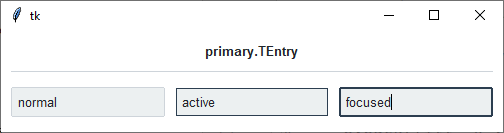
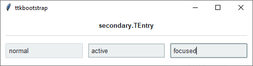
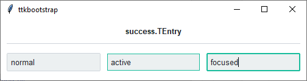
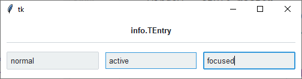
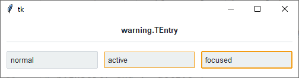
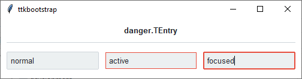

Entry
#####

The `ttk.Entry` widget displays a one-line text string and allows that string to be edited by the user. The value of
the string may be linked to a tkinter variable with the ``textvariable`` option. Entry widgets support horizontal
scrolling with the standard ``xscrollcommand`` option and ``xview`` widget command.

Overview
========
The ``ttk.Entry`` includes the **TEntry** class. The *primary* color is applied by default. This style is further
subclassed by each of the theme colors to produce the following color and style combinations.

As you can see, in a *normal* state, all styles look the same. What distinguishes them are the colors that are used
for the **active** and **focused** states.

How to use
==========

Create a default **entry**

.. code-block:: python

    entry = ttk.Entry(parent)

    entry.insert('Hello world!')

Create an **'info' entry**

.. code-block:: python

    ttk.Entry(parent, style='info.TEntry')

Style configuration
===================

Use the following classes, states, and options when configuring or modifying a new ``ttk.Entry`` style.
:ref:`tutorial:create a new theme` using TTK Creator if you want to change the default color scheme.

Class names
-----------
- TEntry

Dynamic states
--------------
- disabled
- focus
- readonly

Style options
-------------

:background: `color`
:bordercolor: `color`
:borderwidth: `amount`
:darkcolor: `color`
:fieldbackground: `color`
:foreground: `color`
:font: `font`
:lightcolor: `color`
:padding: `padding`
:relief: `flat, groove, raised, ridge, solid, sunken`
:selectbackground: `color`
:selectborderwidth: `amount`
:selectforeground: `color`

Create a custom style
=====================

Change the **font** and **font-size** on all entry widgets

.. code-block:: python

    Style.configure('TEntry', font=('Helvetica', 12))

Change the **foreground color** when in different states

.. code-block:: python

    Style.map('TEntry', foreground=[
        ('disabled', 'gray'),
        ('focus !disabled', 'green'),
        ('hover !disabled', 'yellow')])

Subclass an existing style to create a new one, using the pattern 'newstyle.OldStyle'

.. code-block:: python

    Style.configure('custom.TEntry', background='green', foreground='white', font=('Helvetica', 24))

Use a custom style

.. code-block:: python

    ttk.Entry(parent, style='custom.TEntry')

References
==========

- https://www.pythontutorial.net/tkinter/tkinter-entry/
- https://anzeljg.github.io/rin2/book2/2405/docs/tkinter/ttk-Entry.html
- https://tcl.tk/man/tcl8.6/TkCmd/ttk_entry.htm