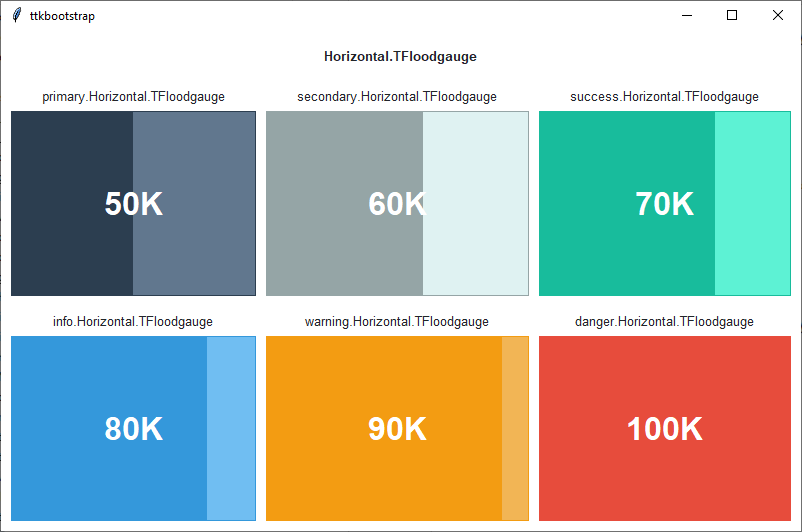

Floodgauge
##########
A ``Floodgauge`` widget shows the status of a long-running operation with an optional text indicator. Similar to the
``ttk.Progressbar``, this widget can operate in two modes: **determinate** mode shows the amount completed relative to
the total amount of work to be done, and **indeterminate** mode provides an animated display to let the user know that
something is happening.

Overview
========
The ``Floodgauge`` includes the **Horizontal.TFloodgauge** and **Vertical.TFloodgauge** styles. These styles are further
subclassed by each of the theme colors to produce the following color and style combinations (the *primary* color is the
default for all floodgauge widgets:

.. image:: images/floodgauge_vertical.png

How to use
==========
The examples below demonstrate how to *use a style* to create a widget. To learn more about how to *use the widget in
ttk*, check out the :ref:`references section <reference:floodgauge>`.

Create a default **horizontal floodgauge**

.. code-block:: python

    Floodgauge(parent, value=75)

Create a default **vertical floodgauge**

.. code-block:: python

    Floodgauge(parent, value=75, orient='vertical')

Create a **success colored horizontal floodgauge**

.. code-block:: python

    Floodgauge(parent, value=75, style='success.Horizontal.TFloodgauge')

Create an **info colored vertical floodgauge**

.. code-block:: python

    Floodgauge(parent, value=75, style='info.Vertical.TFloodgauge', orient='vertical')

Configuration
=============
Use the following classes, states, and options when configuring or modifying a new ttk floodgauge style. See the
`python style documentation`_ for more information on creating a style.

:ref:`tutorial:create a new theme` using TTK Creator if you want to change the default color scheme.

Class names
-----------
- Horizontal.TFloodgauge
- Vertical.TFloodgauge

Style options
-------------
:background: `color`
:barsize: `amount`
:bordercolor: `color`
:borderwidth: `amount`
:darkcolor: `color`
:lightcolor: `color`
:pbarrelief: `flat, groove, raised, ridge, solid, sunken`
:thickness: `amount`
:troughcolor: `color`
:troughrelief: `flat, groove, raised, ridge, solid, sunken`

Create a custom style
=====================
Change the **thickness** and **relief** of all floodgauges

.. code-block:: python

    Style.configure('TFloodgauge', thickness=20, pbarrelief='flat')

Subclass an existing style to create a new one, using the pattern 'newstyle.OldStyle'

.. code-block:: python

    Style.configure('custom.Horizontal.TFloodgauge', background='green', troughcolor='gray')

Use a custom style

.. code-block:: python

    Floodgauge(parent, value=25, orient='horizontal', style='custom.Horizontal.TFloodgauge')

.. _`python style documentation`: https://docs.python.org/3/library/tkinter.ttk.html#ttk-styling