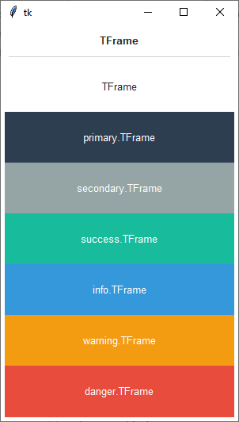

Frame
#####
A ``ttk.Frame`` widget is a container, used to group other widgets together.

Overview
========
The ``ttk.Frame`` includes the **TFrame** class. This class is further subclassed by each of the theme colors to
produce the following color and style combinations. The **TFrame** style is applied to all frame widgets by default and
shares the same color as the theme background.

How to use
==========
The examples below demonstrate how to *use a style* to create a widget. To learn more about how to *use the widget in
ttk*, check out the References_ section for links to documentation and tutorials on this widget.

Create a default **frame**

.. code-block:: python

    ttk.Frame(parent)

Create an **'info' frame**

.. code-block:: python

    ttk.Frame(parent, style='info.TFrame')

Style configuration
===================
Use the following classes, states, and options when configuring or modifying a new ttk button style.
See the `python style documentation`_ for more information on creating a style.

:ref:`tutorial:create a new theme` using TTK Creator if you want to change the default color scheme.

Class names
-----------
- TFrame

Dynamic states
--------------
- disabled
- focus
- pressed
- readonly

Style options
-------------

:background: `color`
:relief: `flat, groove, raised, ridge, solid, sunken`

Create a custom style
=====================

Subclass an existing style to create a new one, using the pattern 'newstyle.OldStyle'

.. code-block:: python

    Style.configure('custom.TFrame', background='green', relief='sunken')

Use a custom style

.. code-block:: python

    ttk.Frame(parent, style='custom.TFrame')

Tips & tricks
=============
If you use a themed **Frame** widget, then you will likely want to use a **Label** widget with an *Inverse.TLabel*
style. This will create the effect that is presented in the Overview_, with the the label background matching the
background color of its parent.

.. code-block:: python

    frm = ttk.Frame(parent, style='danger.TFrame')
    lbl = ttk.Label(f, text='Hello world!', style='danger.Inverse.TLabel')

.. _References:

References
==========
- https://www.pythontutorial.net/tkinter/tkinter-frame/
- https://anzeljg.github.io/rin2/book2/2405/docs/tkinter/ttk-Frame.html
- https://tcl.tk/man/tcl8.6/TkCmd/ttk_frame.htm

.. _`python style documentation`: https://docs.python.org/3/library/tkinter.ttk.html#ttk-styling