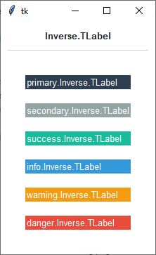

Label
########
A ``ttk.Label`` widget displays a textual label and/or image. The label may be linked to a tkinter variable to
automatically change the displayed text.

Overview
========
The ``ttk.Label`` includes the **TLabel** and **Inverse.TLabel** style classes. The **TLabel** style is applied to
all labels by default. Other styles must be specified with the ``style`` option. These two primary styles are
further subclassed by each of the theme colors to produce the following color and style combinations:

.. image:: images/label.png

The default background color of a **TLabel** is the theme background color. These colors can be *inverted* by using the
**Invert.TLabel** style, which causes the *background* and *foreground* colors to reverse.

How to use
==========

Create a default **label**

.. code-block:: python

    ttk.Label(parent, text='python is great')

Create a default **inverse label**

.. code-block:: python

    ttk.Label(parent, text='python is great', style='Inverse.TLabel')

Create an **'info' label**

.. code-block:: python

    ttk.Label(parent, text='python is great', style='info.TLabel')

Create a **'warning' inverse label**

.. code-block:: python

    ttk.Label(parent, text="python is great", style='warning.Inverse.TLabel')

Style configuration
===================
Use the following classes, states, and options when configuring or modifying a new ttk label style.
:ref:`tutorial:create a new theme` using TTK Creator if you want to change the default color scheme.

Class names
-----------
- TLabel
- Inverse.TLabel

Dynamic states
--------------
- disabled
- readonly

Style options
-------------
:anchor: `e, w, center`
:background: `color`
:bordercolor: `color`
:compound: `top, bottom, left, right`
:darkcolor: `color`
:embossed: `amount`
:foreground: `color`
:font: `font`
:justify: `left, right, center`
:lightcolor: `color`
:padding: `padding`
:relief: `flat, groove, raised, ridge, solid, sunken`
:width: `amount`

Create a custom style
=====================
Change the **font** and **font-size** on all labels

.. code-block:: python

    Style.configure('TLabel', font=('Helvetica', 12))

Subclass an existing style to create a new one, using the pattern 'newstyle.OldStyle'

.. code-block:: python

    Style.configure('custom.TLabel', background='red', foreground='white', font=('Helvetica', 24))

Use a custom style

.. code-block:: python

    ttk.Label(parent, text='what a great label', style='custom.TLabel')

Tips & tricks
=============
You can apply a **TButton** style to a label to inherit the colors and hover effects of the button.

References
==========
- https://www.pythontutorial.net/tkinter/tkinter-label/
- https://anzeljg.github.io/rin2/book2/2405/docs/tkinter/ttk-Label.html
- https://tcl.tk/man/tcl8.6/TkCmd/ttk_label.htm

