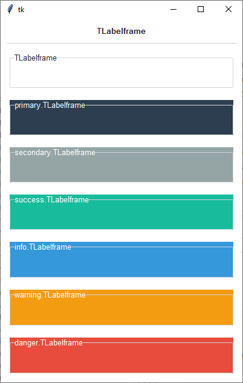

Labelframe
##########
A ``ttk.Labelframe`` widget is a container used to group other widgets together. It has an optional label, which may be
a plain text string or another widget.

Overview
========
The ``ttk.Labelframe`` includes the **TLabelframe** style class. The **TLabelframe** style is applied to
all Labelframes by default and uses the theme *border* color for the frame and *background* color for the background.
Other styles must be specified with the ``style`` option. This style is further subclassed by each of the theme colors
to produce the following color and style combinations:

How to use
==========
The examples below demonstrate how to *use a style* to create a widget. To learn more about how to *use the widget in
ttk*, check out the References_ section for links to documentation and tutorials on this widget.

Create a default **labelframe**

.. code-block:: python

    ttk.Labelframe(parent, text='My widgets')

Create an **'info' labelframe**

.. code-block:: python

    ttk.Labelframe(parent, text='My widgets', style='info.TLabelframe')

Style configuration
===================
Use the following classes, states, and options when configuring or modifying a new ttk labelframe style.
See the `python style documentation`_ for more information on creating a style.

:ref:`tutorial:create a new theme` using TTK Creator if you want to change the default color scheme.

Class names
-----------
- TLabelframe

Dynamic states
--------------
- disabled
- readonly

Style options
-------------
:anchor: `e, w, center`
:background: `color`
:bordercolor: `color`
:borderwidth: `amount`
:darkcolor: `color`
:labelmargins: `amount`
:labeloutside: `boolean`
:lightcolor: `color`
:padding: `padding`
:relief: `flat, groove, raised, ridge, solid, sunken`
:width: `amount`

**TLabelframe.Label** styling options include:

:background: `color`
:darkcolor: `color`
:font: `font`
:foreground: `color`
:lightcolor: `color`

.. _References:

References
==========
- https://www.pythontutorial.net/tkinter/tkinter-labelframe/
- https://anzeljg.github.io/rin2/book2/2405/docs/tkinter/ttk-LabelFrame.html
- https://tcl.tk/man/tcl8.6/TkCmd/ttk_labelframe.htm
- https://tkdocs.com/tutorial/complex.html#labelframe

.. _`python style documentation`: https://docs.python.org/3/library/tkinter.ttk.html#ttk-styling