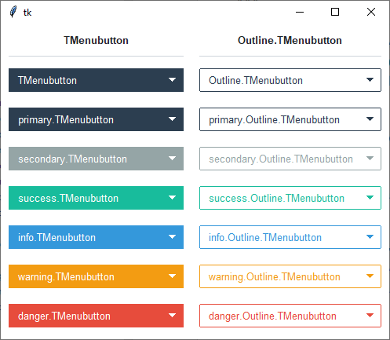
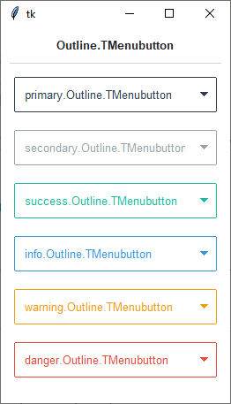

Menubutton
##########
A ``ttk.Menubutton`` widget displays a textual label and/or image, and displays a menu when pressed.

Overview
========
The ``ttk.Menubutton`` includes the **TMenubutton** and **Outline.TMenubutton** style classes. The **TMenubutton** style
is applied to all Menubuttons by default and uses the theme *primary* color as the background. These two primary styles
are further subclassed by each of the theme colors to produce the following color and style combinations:

The **Outline.TMenubutton** style has a solid fill color (matching the regular *TMenubutton*) when hovered or pressed.

How to use
==========
The examples below demonstrate how to *use a style* to create a widget. To learn more about how to *use the widget in
ttk*, check out the References_ section for links to documentation and tutorials on this widget.

Create an **info outline menubutton**

.. code-block:: python

    mb = ttk.Menubutton(parent, text='My widgets', style='info.Outline.TMenubutton')

    # create menu
    menu = tk.Menu(mb)

    # add options
    option_var = tk.StringVar()
    for option in ['option 1', 'option 2', 'option 3']:
        menu.add_radiobutton(label=option, value=option, variable=option_var)

    # associate menu with menubutton
    mb['menu'] = menu

Style configuration
===================
Use the following classes, states, and options when configuring or modifying a new ttk menubutton style.
See the `python style documentation`_ for more information on creating a style.

:ref:`tutorial:create a new theme` using TTK Creator if you want to change the default color scheme.

Class names
-----------
- TMenubutton
- Outline.TMenubutton

Dynamic states
--------------
- active
- disabled
- readonly

Style options
-------------
:arrowsize: `amount`
:arrowcolor: `color`
:arrowpadding: `amount`
:background: `color`
:compound: `top, bottom, left, right`
:bordercolor: `color`
:borderwidth: `amount`
:darkcolor: `color`
:focusthickness: `amount`
:focuscolor: `color`
:foreground: `color`
:font: `font`
:lightcolor: `color`
:padding: `padding`
:relief: `flat, groove, raised, ridge, solid, sunken`

Create a custom style
=====================
Change the **font** and **font-size** on all menubuttons

.. code-block:: python

    Style.configure('TMenubutton', font=('Helvetica', 12))

Subclass an existing style to create a new one, using the pattern 'newstyle.OldStyle'

.. code-block:: python

    Style.configure('custom.TMenubutton', background='red', foreground='white', font=('Helvetica', 24))

Use a custom style

.. code-block:: python

    ttk.Menubutton(parent, text='My widgets', style='custom.TMenubutton')

.. note:: The *Menu* object cannot be configured with ``Style``. Instead, use the tk option database.

    - ``tk.option_add('*Menu.tearoff', 0)``
    - ``tk.option_add('*Menu.foreground', 'white')``
    - ``tk.option_add('*Menu.selectColor', 'blue')``
    - ``tk.option_add('*Menu.font', 'Helvetica 12')``
    - ``tk.option_add('*Menu.background', 'black')``
    - ``tk.option_add('*Menu.activeBackground', 'yellow')``
    - ``tk.option_add('*Menu.activeForegorund', 'blue')``

.. _References:

References
==========
- https://www.pythontutorial.net/tkinter/tkinter-menubutton/
- https://anzeljg.github.io/rin2/book2/2405/docs/tkinter/ttk-Menubutton.html
- https://tcl.tk/man/tcl8.6/TkCmd/ttk_menubutton.htm

.. _`python style documentation`: https://docs.python.org/3/library/tkinter.ttk.html#ttk-styling