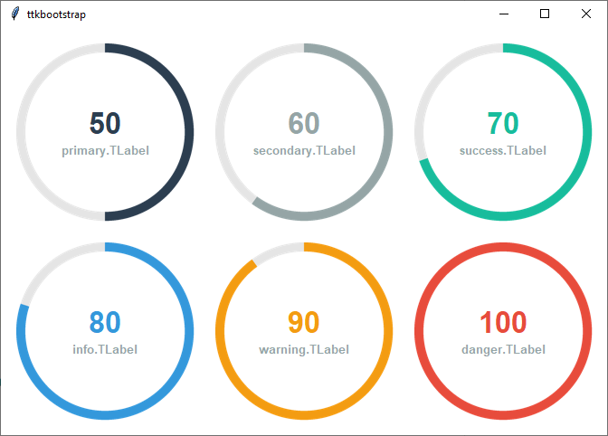
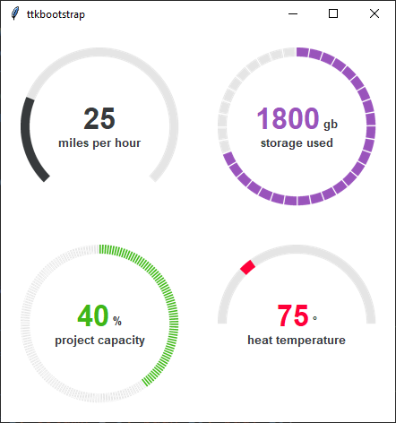

Meter
#####
The ``Meter`` is a custom **ttkbootstrap** widget that can be used to show progress of long-running operations or the
amount of work completed. It can also be used as a `Dial` when `interactive` mode is set to True.

.. note::

    This is a **style guide** for using ttkbootstrap styles. This guide will show you how to **apply visual styles** to
    change the look and feel of the widget. For more information on how to use the widget and what options are
    available, consult the :ref:`reference section on widgets <reference:meter>`.

Overview
========
This widget is very flexible. The ``metertype`` parameter has two stock settings: `full` and `semi`, which shows a full
circle and a semi-circle respectively. Customize the arc of the circle with the ``arcrange`` and ``arcoffset``
parameters. This moves the starting position of the arc and can also be used to make the arc longer or shorter.

The meter color is set with ``meterstyle`` and uses the `TLabel` styles. This also colors the center text. There is an
optional supplementary label `below` the center text that can be styled with the ``labelstyle`` parameter. This setting
also formats the text added with ``textappend`` and ``textprepend``.

The widget color is `primary` by default. The supplementary label is `secondary` by default. Below is an example of the
color options.

The examples below demonstrate how flexible this widget can be. You can see the code for these in the
:ref:`Cookbook <dials_and_meters>`.

How to use
==========
The examples below demonstrate how to *use a style* when creating a meter widget.

Create a default **meter**

.. code-block:: python

    Meter(parent, amountused=25, labeltext='miles per hour')

Create a **danger colored meter**

.. code-block:: python

        Meter(parent, amountused=25, labeltext='miles per hour', meterstyle='danger.TLabel')

Create an **info meter** with an **success label**

.. code-block:: python

        Meter(parent, amountused=25, labeltext='miles per hour', meterstyle='info.TLabel', labelstyle='success.TLabel')

