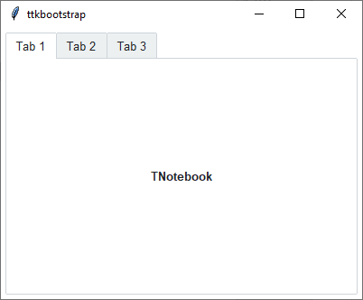

Notebook
########
A ``ttk.Notebook`` widget manages a collection of windows and displays a single one at a time. Each content window is
associated with a tab, which the user may select to change the currently-displayed window.

Overview
========
The ``ttk.Notebook`` includes the **TNotebook** style class. Presently, this style contains default settings for light
and dark themes, but no other styles are included. This may change in the future. See the `Create a custom style`_
section to learn how to customize and create a notebook style.

How to use
==========
Create and use a **notebook**

.. code-block:: python

    # create a new notebook
    nb = ttk.Notebook(parent)

    # create a new frame
    frame = ttk.Frame(nb)

    # set the frame as a tab in the notebook
    nb.add(frame, text='Tab 1')

Configuration
=============
Use the following classes, states, and options when configuring or modifying a new ttk notebook style.
:ref:`tutorial:create a new theme` using TTK Creator if you want to change the default color scheme.

Class names
-----------
- TNotebook
- TNotebook.Tab

Dynamic states
--------------
- active
- disabled
- selected

Style options
-------------
:background: `color`
:bordercolor: `color`
:darkcolor: `color`
:foreground: `color`
:lightcolor: `color`:
:padding: `padding`
:tabmargins: `padding`
:tabposition: `n, s, e, w, ne, en, nw, wn, se, es, sw, ws`

**TNotebook.Tab** styling options include:

:background: `color`
:bordercolor: `color`
:compound: `left, right, top, button`
:expand: `padding`
:font: `font`
:foreground: `color`
:padding: `padding`

Create a custom style
=====================
Subclass an existing style to create a new one, using the pattern 'newstyle.OldStyle'. In this example, the tab position
is set to the *southwest* corner of the notebook... by default it is on the *northwest* corner.

.. code-block:: python

    # set the tabs on the sw corner of the notebook
    Style.configure('custom.TNotebook', tabposition='sw')

Use a custom style

.. code-block:: python

    nb = ttk.Notebook(parent, style='custom.TNotebook')

References
==========
- https://anzeljg.github.io/rin2/book2/2405/docs/tkinter/ttk-Notebook.html
- https://tkdocs.com/tutorial/complex.html#notebook
- https://docs.python.org/3/library/tkinter.ttk.html#ttk-notebook
- https://tcl.tk/man/tcl8.6/TkCmd/ttk_notebook.htm
