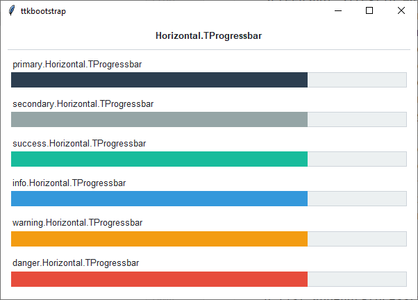
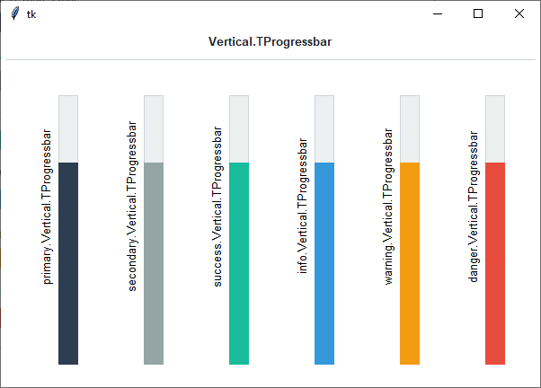
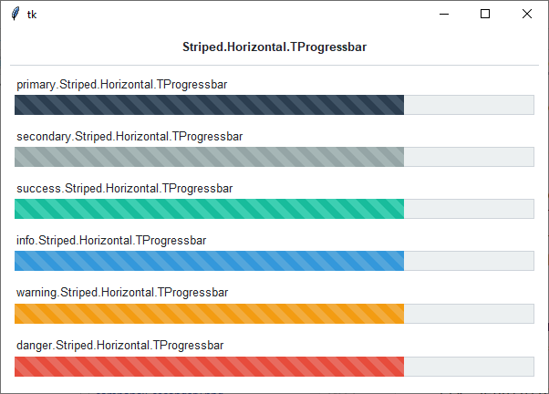

Progressbar
###########
A ``ttk.Progressbar`` widget shows the status of a long-running operation. They can operate in two modes: determinate
mode shows the amount completed relative to the total amount of work to be done, and indeterminate mode provides an
animated display to let the user know that something is happening.

Overview
========
The ``ttk.Progressbar`` includes the **Horizontal.TProgressbar**, **Vertical.TProgressbar**, and
**Striped.Horizontal.TProgressbar** styles. These styles are further subclassed by each of the theme colors to produce
the following color and style combinations (the *primary* color is the default for all progress bars:

How to use
==========
The examples below demonstrate how to *use a style* to create a widget. To learn more about how to *use the widget in
ttk*, check out the References_ section for links to documentation and tutorials on this widget.

Create a default **horizontal progressbar**

.. code-block:: python

    ttk.Progressbar(parent, value=75)

Create a default **vertical progressbar**

.. code-block:: python

    ttk.Progressbar(parent, value=75, orient='vertical')

Create a default **horizontal striped progressbar**

.. code-block:: python

    ttk.Progressbar(parent, value=75, style='Striped.Horizontal.TProgressbar')

Create a **success horizontal striped progressbar**

.. code-block:: python

    ttk.Progressbar(parent, value=75, style='success.Striped.Horizontal.TProgressbar')

Configuration
=============
Use the following classes, states, and options when configuring or modifying a new ttk progressbar style. The
*Striped.Horizontal.TProgressbar* is an image-based layout, so the styling options will be limited to those
which affect the *trough*. The regular progressbar styles can be configured with all available options.
See the `python style documentation`_ for more information on creating a style.

:ref:`tutorial:create a new theme` using TTK Creator if you want to change the default color scheme.

Class names
-----------
- Horizontal.TProgressbar
- Vertical.TProgressbar
- Striped.Horizontal.TProgressbar

Style options
-------------
:background: `color`
:barsize: `amount`
:bordercolor: `color`
:borderwidth: `amount`
:darkcolor: `color`
:lightcolor: `color`
:pbarrelief: `flat, groove, raised, ridge, solid, sunken`
:thickness: `amount`
:troughcolor: `color`
:troughrelief: `flat, groove, raised, ridge, solid, sunken`

Create a custom style
=====================
Change the **thickness** and **relief** of all progressbars

.. code-block:: python

    Style.configure('TProgressbar', thickness=20, pbarrelief='flat')

Subclass an existing style to create a new one, using the pattern 'newstyle.OldStyle'

.. code-block:: python

    Style.configure('custom.Horizontal.TProgressbar', background='green', troughcolor='gray')

Use a custom style

.. code-block:: python

    ttk.Progressbar(parent, value=25, orient='horizontal', style='custom.Horizontal.TProgressbar')

.. _References:

References
==========
- https://docs.python.org/3/library/tkinter.ttk.html#ttk-progressbar
- https://www.pythontutorial.net/tkinter/tkinter-progressbar/
- https://anzeljg.github.io/rin2/book2/2405/docs/tkinter/ttk-Progressbar.html
- https://tcl.tk/man/tcl8.6/TkCmd/ttk_progressbar.htm

.. _`python style documentation`: https://docs.python.org/3/library/tkinter.ttk.html#ttk-styling