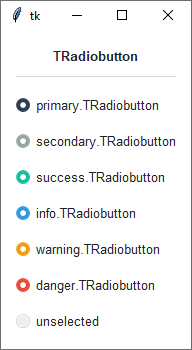
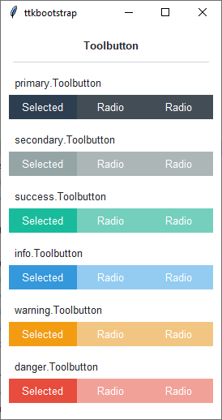
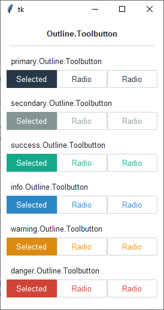

Radiobutton
###########
A ``ttk.Radiobutton`` widget is used in groups to show or change a set of mutually-exclusive options. Radiobuttons are
linked to a tkinter variable, and have an associated value; when a radiobutton is clicked, it sets the variable to its
associated value.

Overview
========
The ``ttk.Radiobutton`` includes the **TRadiobutton**, **ToolButton**, and **Outline.Toolbutton** styles. These styles
are further subclassed by each of the theme colors to produce the following color and style combinations:

How to use
==========
Create a default **radiobutton**

.. code-block:: python

    ttk.Radiobutton(parent, text='option 1')

Create a default **toolbutton**

.. code-block:: python

    ttk.Radiobutton(parent, text='option 2', style='Toolbutton')

Create a default **outline toolbutton**

.. code-block:: python

    ttk.Radiobutton(parent, text='option 3', style='Outline.Toolbutton')

Create an **'info' radiobutton**

.. code-block:: python

    ttk.Radiobutton(parent, text='option 4', style='info.TRadiobutton')

Create a **'warning' outline toolbutton**

.. code-block:: python

    ttk.Radiobutton(parent, text="option 5", style='warning.Outline.Toolbutton')

Configuration
=============
Use the following classes, states, and options when configuring or modifying a new ttk radiobutton style. TTK Bootstrap
uses an image layout for the **TRadiobutton** style on this widget, so not all of these options will be available... for
example: ``indicatormargin``. However, if you decide to create a new widget, these should be available, depending on the
style you are using as a base. Some options are only available in certain styles.

Class names
-----------
- TRadiobutton
- Toolbutton
- Outline.Toolbutton

Dynamic states
--------------
- active
- alternate
- disabled
- pressed
- selected
- readonly

Style options
-------------
:background: `color`
:compound: `compound`
:foreground: `foreground`
:focuscolor: `color`
:focusthickness: `amount`
:font: `font`
:padding: `padding`

Create a custom style
=====================

Change the **font** and **font-size** on all radiobuttons

.. code-block:: python

    Style.configure('TRadiobutton', font=('Helvetica', 12))

Change the **foreground color** when the radiobutton is **selected**

.. code-block:: python

    Style.map('TRadiobutton', foreground=[
        ('disabled', 'white'),
        ('selected', 'yellow'),
        ('!selected', 'gray')])

Subclass an existing style to create a new one, using the pattern 'newstyle.OldStyle'

.. code-block:: python

    Style.configure('custom.TRadiobutton', foreground='white', font=('Helvetica', 24))

Use a custom style

.. code-block:: python

    ttk.Radiobutton(parent, text='option 1', style='custom.TRadiobutton')

References
==========
- https://www.pythontutorial.net/tkinter/tkinter-radio-button/
- https://anzeljg.github.io/rin2/book2/2405/docs/tkinter/ttk-Radiobutton.html
- https://tcl.tk/man/tcl8.6/TkCmd/ttk_radiobutton.htm
