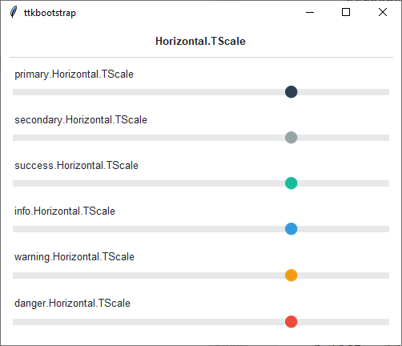
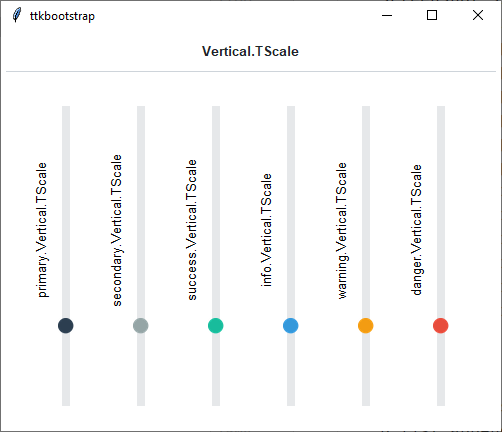

Slider
#####
A ``ttk.Scale`` widget is typically used to control the numeric value of a linked variable that varies uniformly over
some range. A scale displays a slider that can be moved along over a trough, with the relative position of the slider
over the trough indicating the value of the variable.

Overview
========
The ``ttk.Scale`` includes the **Horizontal.TScale** and **Vertical.TScale** style classes. These styles are further
subclassed by each of the theme colors to produce the following color and style combinations:

How to use
==========
Create a default **horizontal scale**

.. code-block:: python

    ttk.Scale(parent, from_=0, to=100, value=75)

Create a default **vertical scale**

.. code-block:: python

    ttk.Scale(parent, from_=0, to=100, value=75, orient='vertical')

Configuration
=============
Use the following classes, states, and options when configuring or modifying a new ttk progressbar style. TTK Bootstrap
uses an image layout for this widget, so styling options will be limited, and not all options below will be available
for ttk bootstrap themes.

Class names
-----------
- Horizontal.TScale
- Vertical.TScale

Dynamic states
--------------
- Active

Style options
-------------
:background: `color`
:borderwidth: `amount`
:darkcolor: `color`
:groovewidth: `amount`
:lightcolor: `color`
:sliderwidth: `amount`
:troughcolor: `color`
:relief: `flat, groove, raised, ridge, solid, sunken`

References
==========
- https://www.pythontutorial.net/tkinter/tkinter-slider/
- https://anzeljg.github.io/rin2/book2/2405/docs/tkinter/ttk-Scale.html
- https://tcl.tk/man/tcl8.6/TkCmd/ttk_scale.htm
