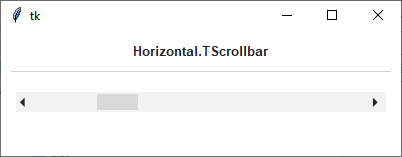
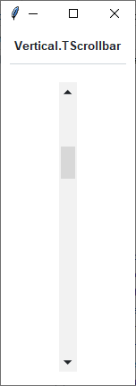

Scrollbar
#########
``ttk.Scrollbar`` widgets are typically linked to an associated window that displays a document of some sort, such as a
file being edited or a drawing. A scrollbar displays a thumb in the middle portion of the scrollbar, whose position and
size provides information about the portion of the document visible in the associated window. The thumb may be dragged
by the user to control the visible region. Depending on the theme, two or more arrow buttons may also be present; these
are used to scroll the visible region in discrete units.

Overview
========
The ``ttk.Scrollbar`` includes the **Horizontal.TScrollbar** and **Vertical.TScrollbar** style classes. These styles
are applied by default to *horizontal* and *vertical* orientations. So there is no need to specify the styles unless
you decide to create a new custom style.

How to use
==========
The examples below demonstrate how to *use a style* to create a widget. To learn more about how to *use the widget in
ttk*, check out the References_ section for links to documentation and tutorials on this widget.

Create a default **horizontal scrollbar**

.. code-block:: python

    ttk.Scrollbar(parent, orient='horizontal')

Create a default **vertical scrollbar**

.. code-block:: python

    ttk.Scrollbar(parent, orient='vertical')

Configuration
=============
Use the following classes, states, and options when configuring or modifying a new ttk scrollbar style. TTK Bootstrap
uses an image layout for parts of this widget (the arrows), so styling options will not affect these elements. However,
if you choose to create your own scrollbar layout and style, you may use whatever style options are available for your
custom style. See the `python style documentation`_ for more information on creating a style.

:ref:`tutorial:create a new theme` using TTK Creator if you want to change the default color scheme.

Class names
-----------
- Horizontal.TScrollbar
- Vertical.TScrollbar

Dynamic states
--------------
- active
- disabled

Style options
-------------
:arrowcolor: `color`
:arrowsize: `amount`
:background: `color`
:bordercolor: `color`
:gripcount: `amount`
:groovewidth: `amount`
:relief: `flat, groove, raised, ridge, solid, sunken`
:troughborderwidth: `amount`
:troughcolor: `color`
:troughrelief: `flat, groove, raised, ridge, solid, sunken`
:width: `amount`

Create a custom style
=====================
Change the **thickness** and **background** of all scrollbars

.. code-block:: python

    Style.configure('TScrollbar', width=30, background='black')

Subclass an existing style to create a new one, using the pattern 'newstyle.OldStyle'

.. code-block:: python

    Style.configure('custom.Horizontal.TScrollbar', background='black', troughcolor='white', arrowcolor='white')

Use a custom style

.. code-block:: python

    ttk.Scrollbar(parent, orient='horizontal', style='custom.Horizontal.TScrollbar')

.. _References:

References
==========
- https://www.pythontutorial.net/tkinter/tkinter-scrollbar/
- https://anzeljg.github.io/rin2/book2/2405/docs/tkinter/ttk-Scrollbar.html
- https://www.tcl.tk/man/tcl8.6/TkCmd/ttk_scrollbar.htm

.. _`python style documentation`: https://docs.python.org/3/library/tkinter.ttk.html#ttk-styling