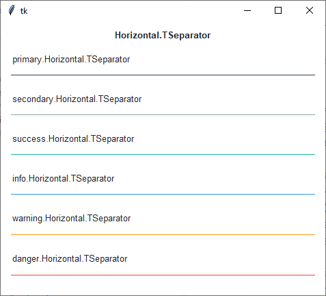
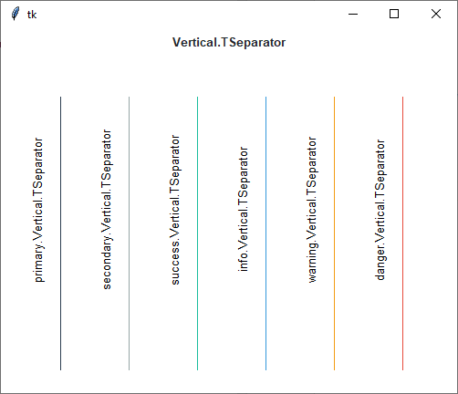

Separator
#########
A ``ttk.Separator`` widget displays a horizontal or vertical separator bar.

Overview
========
The ``ttk.Separator`` includes the **Horizontal.TSeparator** and **Vertical.TSeparator** style classes. These styles
are applied by default to *horizontal* and *vertical* orientations. These styles are further subclassed by each of the
theme colors to produce the following color and style combinations:

How to use
==========
The examples below demonstrate how to *use a style* to create a widget. To learn more about how to *use the widget in
ttk*, check out the References_ section for links to documentation and tutorials on this widget.

Create a default **horizontal separator**

.. code-block:: python

    ttk.Separator(parent, orient='horizontal')

Create a default **vertical separator**

.. code-block:: python

    ttk.Separator(parent, orient='vertical')

Create an **info vertical separator**

.. code-block:: python

    ttk.Separator(parent, orient='vertical', style='info.Vertical.TSeparator')

Configuration
=============
Use the following classes, states, and options when configuring or modifying a new ttk separator style. TTK Bootstrap
uses an image layout for this widget, so it is not possible to create a custom style without building a new layout.
However, if you decide to build your own layout, you are free to use the styling options below.
See the `python style documentation`_ for more information on creating a style.

:ref:`tutorial:create a new theme` using TTK Creator if you want to change the default color scheme.

Class names
-----------
- Horizontal.TSeparator
- Vertical.TSeparator

Style options
-------------
:background: `color`

.. _References:

References
==========
- https://www.pythontutorial.net/tkinter/tkinter-separator/
- https://anzeljg.github.io/rin2/book2/2405/docs/tkinter/ttk-Separator.html
- https://www.tcl.tk/man/tcl8.6/TkCmd/ttk_separator.htm

.. _`python style documentation`: https://docs.python.org/3/library/tkinter.ttk.html#ttk-styling