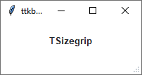
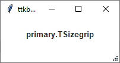
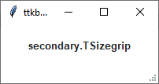
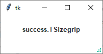
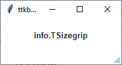
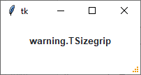
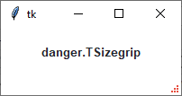

Sizegrip
########
A ``ttk.Sizegrip widget`` (also known as a grow box) allows the user to resize the containing toplevel window by
pressing and dragging the grip.

Overview
========
The ``ttk.Sizegrip`` includes the **TSizegrip** style class. By default, the color of the sizegrip is the `border`
color for light themes and the `inputfg` color for dark themes. This is further subclassed by each of the theme colors
to produce the following color and style combinations:

How to use
==========
The examples below demonstrate how to *use a style* to create a widget. To learn more about how to *use the widget in
ttk*, check out the References_ section for links to documentation and tutorials on this widget.

Create a default **sizegrip**

.. code-block:: python

    ttk.Sizegrip(parent)

Create a **success sizegrip**

.. code-block:: python

    ttk.Sizegrip(parent, style='success.TSizegrip')

Configuration
=============
Use the following classes, states, and options when configuring or modifying a new ttk sizegrip style. TTK Bootstrap
uses an image layout for this widget, so styling options will not be available for TTK Bootstrap themes.
See the `python style documentation`_ for more information on creating a style.

:ref:`tutorial:create a new theme` using TTK Creator if you want to change the default color scheme.

Class names
-----------
- TSizegrip

Style options
-------------
- background `color`

.. _References:

References
==========
- https://docs.python.org/3/library/tkinter.ttk.html#sizegrip
- https://www.pythontutorial.net/tkinter/tkinter-sizegrip/
- https://anzeljg.github.io/rin2/book2/2405/docs/tkinter/ttk-Sizegrip.html
- https://www.tcl.tk/man/tcl8.6/TkCmd/ttk_sizegrip.htm

.. _`python style documentation`: https://docs.python.org/3/library/tkinter.ttk.html#ttk-styling