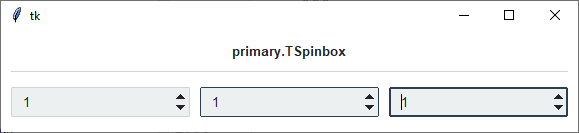
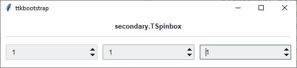
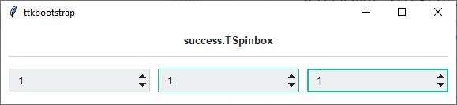
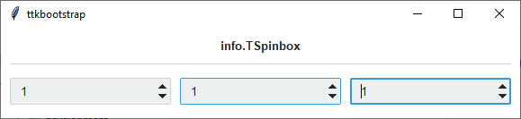
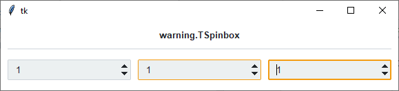
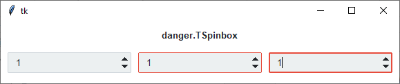

Spinbox
########
A ``ttk.Spinbox`` widget is a ``ttk.Entry`` widget with built-in up and down buttons that are used to either modify a
numeric value or to select among a set of values. The widget implements all the features of the ``ttk.Entry`` widget
including support of the ``textvariable`` option to link the value displayed by the widget to a tkinter variable.

Overview
========

The ``ttk.Spinbox`` includes the **TSpinbox** class. The *primary* color is applied to this widget by default. This style
is further subclassed by each of the theme colors to produce the following color and style combinations.

As you can see, in a *normal* state, all styles look the same. What distinguishes them are the colors that are used
for the **active** and **focused** states.

How to use
==========
The examples below demonstrate how to *use a style* to create a widget. To learn more about how to *use the widget in
ttk*, check out the References_ section for links to documentation and tutorials on this widget.

Create a default **spinbox**

.. code-block:: python

    cb = ttk.Spinbox(parent, from_=1, to=100)

Create an **'info' spinbox**

.. code-block:: python

    ttk.Spinbox(parent, from_=1, to=100, style='info.TSpinbox')

Configuration
=============
Use the following classes, states, and options when configuring or modifying a new ttk spinbox style. Or,
See the `python style documentation`_ for more information on creating a style.

:ref:`create a new theme <tutorial:create a new theme>` using TTK Creator if you want to change the default color
scheme.

Class names
-----------
- TSpinbox

Dynamic states
--------------
- active
- disabled
- focus
- readonly

Style options
-------------
:arrowcolor: `color`
:arrowsize: `amount`
:background: `color` (same as fieldbackground)
:bordercolor: `color`
:darkcolor: `color`
:fieldbackground: `color`
:foreground: `color`
:insertcolor: `color`
:insertwidth: `amount`
:lightcolor: `color`
:padding: `padding`
:selectbackground: `color`
:selectforeground: `color`

Create a custom style
=====================
Change the **arrow color** when in different states

.. code-block:: python

    Style.map('TSpinbox', arrowcolor=[
        ('disabled', 'gray'),
        ('pressed !disabled', 'blue'),
        ('focus !disabled', 'green'),
        ('hover !disabled', 'yellow')])

Subclass an existing style to create a new one, using the pattern 'newstyle.OldStyle'

.. code-block:: python

    Style.configure('custom.TSpinbox', background='green', foreground='white', font=('Helvetica', 24))

Use a custom style

.. code-block:: python

    ttk.Spinbox(parent, style='custom.TSpinbox')

.. _References:

References
==========
- https://www.pythontutorial.net/tkinter/tkinter-spinbox/
- https://www.tcl.tk/man/tcl8.6/TkCmd/ttk_spinbox.htm

.. _`python style documentation`: https://docs.python.org/3/library/tkinter.ttk.html#ttk-styling