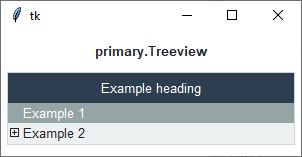
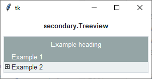
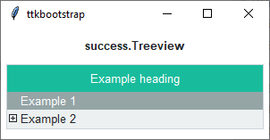
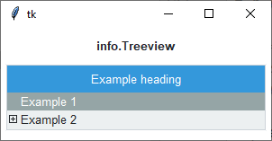
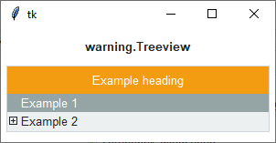
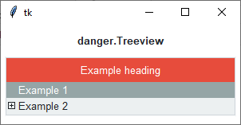

Treeview
########
The ``ttk.Treeview`` widget displays a hierarchical collection of items. Each item has a textual label, an optional
image, and an optional list of data values. The data values are displayed in successive columns after the tree label.

The order in which data values are displayed may be controlled by setting the `displaycolumns` widget option. The tree
widget can also display column headings. Columns may be accessed by number or by symbolic names listed in the `columns`
widget option.

Each item is identified by a unique name. The widget will generate item IDs if they are not supplied by the caller.
There is a distinguished root item, named {}. The root item itself is not displayed; its children appear at the top
level of the hierarchy.

Each item also has a list of tags, which can be used to associate event bindings with individual items and control the
appearance of the item.

Treeview widgets support horizontal and vertical scrolling with the standard `[xy]scrollcommand` options and `[xy]view`
widget commands.

Overview
========
The ``ttk.Treeview`` includes the **Treeview** class. The *primary* color is applied to this widget by default. This
style is further subclassed by each of the theme colors to produce the following color and style combinations.

How to use
==========
The examples below demonstrate how to *use a style* to create a widget. To learn more about how to *use the widget in
ttk*, check out the References_ section for links to documentation and tutorials on this widget.

Create a default **treeview**

.. code-block:: python

    cb = ttk.Treeview(parent, columns=[1, 2, 3], show='headings')

Create an **'info' treeview**

.. code-block:: python

    ttk.Treeview(parent, columns=[1, 2, 3], show='headings', style='info.Treeview')

Configuration
=============
Use the following classes, states, and options when configuring or modifying a new ttk separator style.
See the `python style documentation`_ for more information on creating a style.

:ref:`tutorial:create a new theme` using TTK Creator if you want to change the default color scheme.

Class names
-----------
- Treeview
- Heading
- Item
- Cell

Dynamic states
--------------
- disabled
- selected

Style options
-------------
**Treeview** styling options include:

:background: `color`
:fieldbackground: `color`
:font: `font`
:foreground: `color`
:rowheight: `amount`

**Heading** styling options include:

:background: `color`
:font: `font`
:relief: `relief`

**Item** styling options include:

:foreground: `color`
:indicatormargins: `padding`
:indicatorsize: `amount`
:padding: `padding`

**Cell** styling options include:

:padding: `padding`

.. _References:

References
==========
- https://docs.python.org/3/library/tkinter.ttk.html#treeview
- https://www.pythontutorial.net/tkinter/tkinter-treeview/
- https://anzeljg.github.io/rin2/book2/2405/docs/tkinter/ttk-Treeview.html
- https://tcl.tk/man/tcl8.6/TkCmd/ttk_treeview.htm

.. _`python style documentation`: https://docs.python.org/3/library/tkinter.ttk.html#ttk-styling
