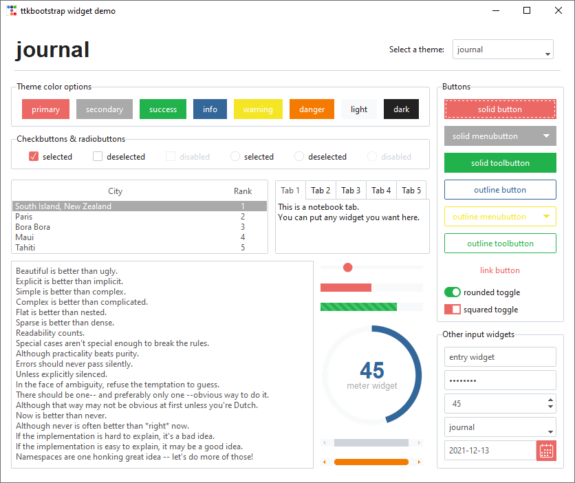
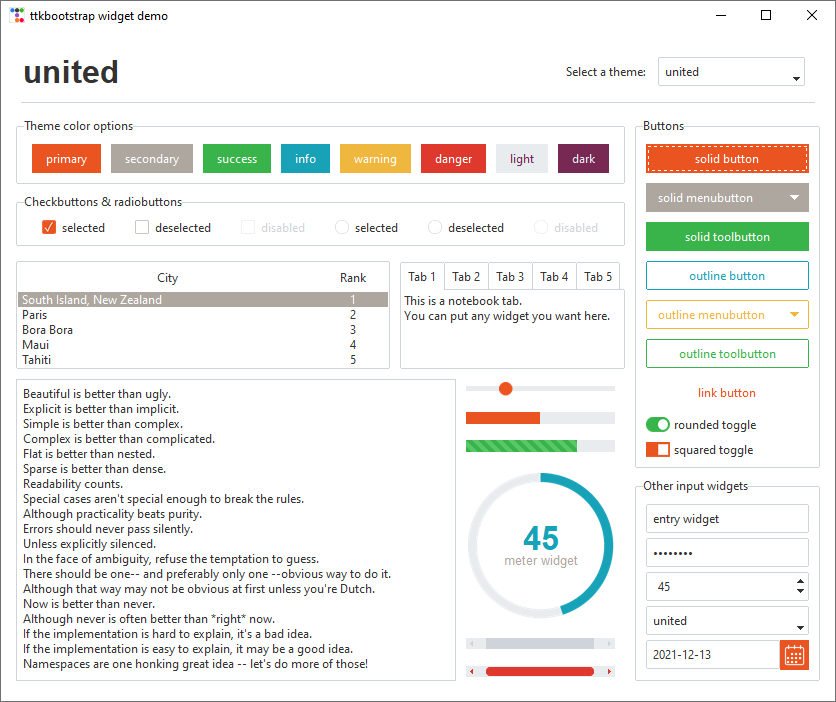
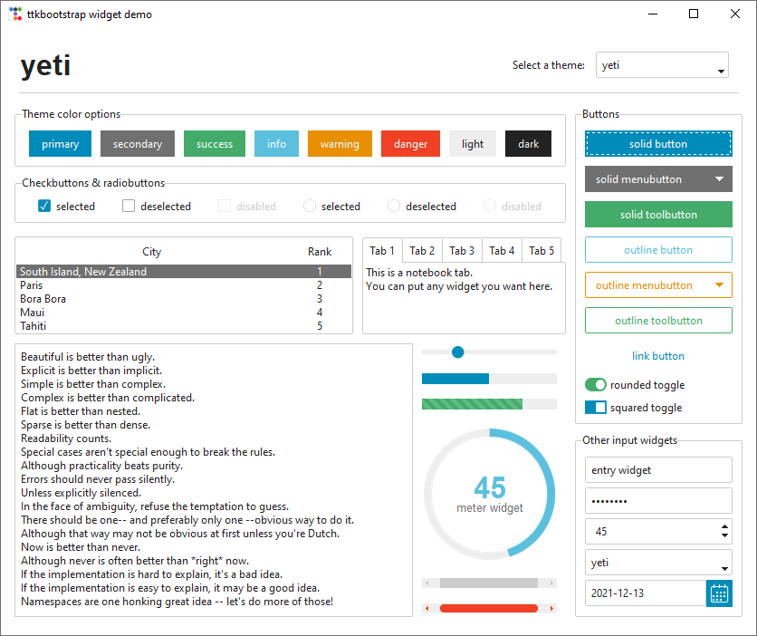

# 浅色主题

以下浅色主题很大程度上受到 [https://bootswatch.com/](https://bootswatch.com/) 的启发

[灵感来源](https://bootswatch.com/cosmo/)

[灵感来源](https://bootswatch.com/flatly/)

[灵感来源](https://bootswatch.com/journal/)

[灵感来源](https://bootswatch.com/litera/)

[灵感来源](https://bootswatch.com/lumen/)

[灵感来源](https://bootswatch.com/minty/)

[灵感来源](https://bootswatch.com/pulse/)

[灵感来源](https://bootswatch.com/sandstone/)

[灵感来源](https://bootswatch.com/united/)

[灵感来源](https://bootswatch.com/yeti/)

[灵感来源](https://bootswatch.com/morph/)

[灵感来源](https://bootswatch.com/simplex/)

[灵感来源](https://bootswatch.com/cerulean/)